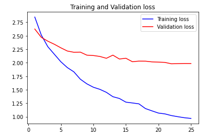
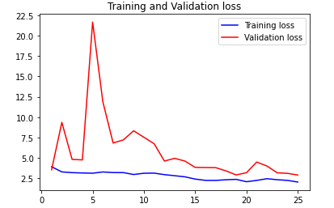
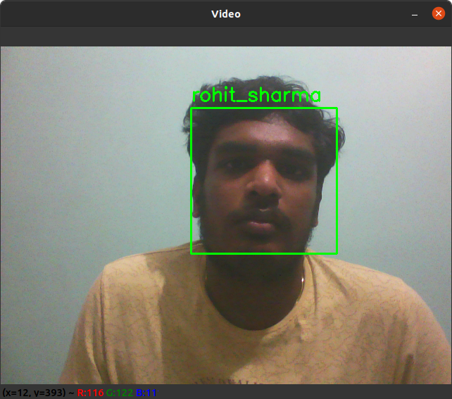

# Evolv Machine Learning Challenge

### Dataset details
Dataset contains around 600 images of 15 top Indian cricket players (who have participated in the 2019 ICC Men's Cricket World Cup). There are 30-50 images per player

### Level-1 (Creating Classifier)
- The given dataset exactly contained around 576 images of 15 Indian cricket players. 
- The images were given in a folder where each players image being put in a subfolder and a common csv file containing the details of the player and their image-id.
- I used a iterative looper that reads all the images player by player and adds it to a list. Paralley the labels corresponding to each of the image loaded was appended to another list.
- For the trian and test split, i randomly split the given data into train and test data using 85 percent for training and remaining for testing while loading each player, so that each players image is in test and train datasets. 
- After the split, we have 483 images for training and 93 images for testing, they were normalized to 1. All the images that was available was resized to the 224x224. 
- Later on I used the Label Encoder to encode the labels to numbers from 0-14.
- For loading the images, i used the keras imgae data pipleline "ImageDataGenerator" and made the pipeline, since it increases the spped of operation.
- For the models, i tried with two modelsone of them is a sequential CNN model defined by me and other one was that the "MobileNetV2", in which i used the same weights trained on the Imagenet Dataset.
- For the compiling part, i used "adam" as the optimizer and started the training of the model for 25 epocjs with a batch size of 32.
- After the entire training process the following accuracies where obatined,
1. Transfer learning model
- Train Accuracy: 81.57349824905396
- Test Accuracy: 40.860214829444885

2. Simple CNN model
- Train Accuracy: 48.240166902542114
- Test Accuracy: 27.956989407539368

### Level-2 (Face detection+Classification)
- From the above task, i saved the best model as "model_params.h5", so that i can load the file and reconstruct the trained model for classification of the image.
- I also loaded the "haarcascade face classifier" for detecting face in live video, after capturing the video, and detecting the face, i cropped the part of the frame with the face.
- Later on i passed that cropped image to the reconstructed model and predicted the best suiting class to the given face, and printed the name of the player on top of the bounding box.

